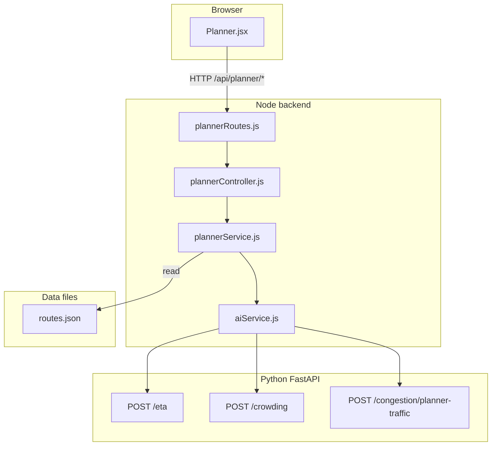

# AI-powered commute planner (simple guide)

**What users get:** Pick origin stop, destination stop, and hour. The app suggests bus routes (can include transfers), total time (ETA), how crowded it might be, and short explanations. **Return directions** are modeled as separate routes named `{Route} (Return)` with reversed stop order so trips such as Banasree → Badda can use the same line’s backward path.

---

## Workflow (how data moves)

1. User submits the form → `POST /api/planner/commute`.
2. `plannerService.js` builds a **graph** from `routes.json`, finds paths (Dijkstra), may add **transfer** time between lines.
3. For each bus **segment**, Node calls FastAPI **ETA** and **crowding** models.
4. **Traffic level** for ETA (`HIGH` / `MEDIUM` / `LOW`) comes from **`/congestion/planner-traffic`** when AI is up; otherwise a simple rule based on hour.

---

## Every file that belongs to this feature

### Data (JSON)

| File | Role |
|------|------|
| [`ai-services/data/routes.json`](../ai-services/data/routes.json) | Route names and stop order — **the network** the planner searches (includes **`… (Return)`** rows for reverse directions) |

### Training data (CSV)

| File | Role |
|------|------|
| [`ai-services/data/eta_dataset.csv`](../ai-services/data/eta_dataset.csv) | Historical-style rows used to train segment ETA |
| [`ai-services/data/crowd_dataset.csv`](../ai-services/data/crowd_dataset.csv) | Rows used to train crowding |

### Trained models (PKL) — under `ai-services/models/`

| File | Role |
|------|------|
| `eta_model.pkl` | Predicts minutes for one segment |
| `crowd_model.pkl` | Predicts LOW/MEDIUM/HIGH crowding at a stop |

### Encoders (PKL) — under `ai-services/encoders/`

| File | Role |
|------|------|
| `route_encoder.pkl` | Maps route name string → number for the model |
| `stop_encoder.pkl` | Maps stop name → number |
| `traffic_encoder.pkl` | Maps traffic level string → number |
| `crowd_encoder.pkl` | Maps crowd label back to text |

### Training scripts (Python)

| File | Role |
|------|------|
| [`ai-services/training/train_eta.py`](../ai-services/training/train_eta.py) | Builds ETA model + route/stop/traffic encoders from `eta_dataset.csv` |
| [`ai-services/training/train_crowd.py`](../ai-services/training/train_crowd.py) | Builds crowding model + encoders from `crowd_dataset.csv` |
| [`ai-services/training/augment_return_training_data.py`](../ai-services/training/augment_return_training_data.py) | After changing `routes.json`, augments ETA + crowd CSV rows for **`(Return)`** routes (idempotent); then retrain ETA + crowd + congestion |
| [`ai-services/training/paths.py`](../ai-services/training/paths.py) | Imports paths from `ml_paths.py` for scripts |
| [`ai-services/ml_paths.py`](../ai-services/ml_paths.py) | Single place for all `.pkl` and `.csv` paths |

### AI HTTP API (Python)

| File | Role |
|------|------|
| [`ai-services/app/main.py`](../ai-services/app/main.py) | Loads ETA + crowding `.pkl` at startup; defines `POST /eta` and `POST /crowding` |
| [`ai-services/app/api/congestion.py`](../ai-services/app/api/congestion.py) | `POST /congestion/planner-traffic` — turns many segment predictions into one traffic level for the planner |

### Backend (Node)

| File | Role |
|------|------|
| [`backend/services/plannerService.js`](../backend/services/plannerService.js) | Graph search, ETA/crowd aggregation, `time_type` (leave vs arrive) |
| [`backend/controllers/plannerController.js`](../backend/controllers/plannerController.js) | Checks request body, calls planner service |
| [`backend/routes/plannerRoutes.js`](../backend/routes/plannerRoutes.js) | `GET /stops`, `POST /commute` under `/api/planner` |
| [`backend/services/aiService.js`](../backend/services/aiService.js) | HTTP client to FastAPI (`getETA`, `getCrowding`, `getPlannerTrafficLevel`) |
| [`backend/app.js`](../backend/app.js) | Mounts planner routes |

### Frontend

| File | Role |
|------|------|
| [`frontend/src/pages/Planner.jsx`](../frontend/src/pages/Planner.jsx) | Form and results list |
| [`frontend/src/services/api.js`](../frontend/src/services/api.js) | Axios base URL from `VITE_API_URL` |

---

## How to verify it works

1. Train ETA + crowd PKL, start FastAPI, set `AI_SERVICE_URL` in backend `.env`.
2. Open `/planner`, choose two different stops, click plan — you should see ETA and crowd.
3. Optional: `POST /api/planner/commute` with JSON `origin`, `destination`, `hour`, `time_type`.

---

## Not in this feature (for later)

- Picking stops on a map (needs GPS + UI work).
- Walking between stops (only transfer penalty at same stop today).
