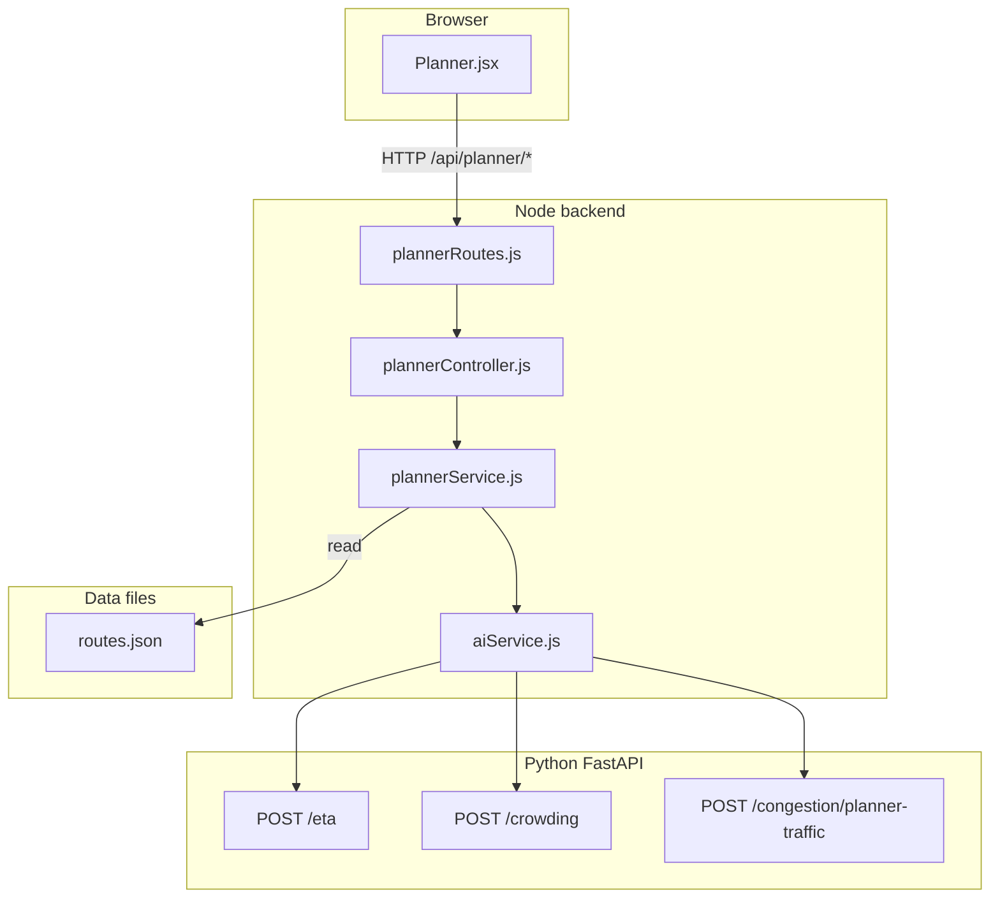

# AI-powered commute planner (simple guide)

**What users get:** Pick origin stop, destination stop, and time. The app suggests bus routes (can include transfers and short walking links), total ETA, crowding, map path, landmark points, and short explanations. **Return directions** are modeled as separate routes named `{Route} (Return)` with reversed stop order so trips such as Banasree → Badda can use the same line’s backward path.

---

## Workflow (how data moves)

1. User submits the form → `POST /api/planner/commute`.
2. `plannerService.js` builds a **graph** from `routes.json`, finds paths (Dijkstra), may add **transfer** time between lines.
3. For each bus **segment**, Node calls FastAPI **ETA** and **crowding** models.
4. Segment-level congestion (`/congestion/predict`) is used per leg before ETA calls, with global fallback.
5. Planner supports simulation tracking: **ETA to user**, then **ETA to destination** after onboard confirmation.

---

## Every file that belongs to this feature

### Data (JSON)

| File | Role |
|------|------|
| [`ai-services/data/routes.json`](../ai-services/data/routes.json) | Route names and stop order — **the network** the planner searches (includes **`… (Return)`** rows for reverse directions) |
| [`ai-services/data/stops.json`](../ai-services/data/stops.json) | Stop coordinates used for map paths, walking edges, and fleet simulation |
| [`ai-services/data/route_geometries.json`](../ai-services/data/route_geometries.json) | Landmark metadata for route visualization |
| [`ai-services/data/history/fleet_loop_history.jsonl`](../ai-services/data/history/fleet_loop_history.jsonl) | Append-only simulated loop history per bus |

### Training data (CSV)

| File | Role |
|------|------|
| [`ai-services/data/eta_dataset.csv`](../ai-services/data/eta_dataset.csv) | Historical-style rows used to train segment ETA |
| [`ai-services/data/crowd_dataset.csv`](../ai-services/data/crowd_dataset.csv) | Rows used to train crowding |

### Trained models (PKL) — under `ai-services/models/`

| File | Role |
|------|------|
| `eta_model.pkl` | Predicts minutes for one segment |
| `crowd_model.pkl` | Predicts LOW/MEDIUM/HIGH crowding at a stop |

### Encoders (PKL) — under `ai-services/encoders/`

| File | Role |
|------|------|
| `route_encoder.pkl` | Maps route name string → number for the model |
| `stop_encoder.pkl` | Maps stop name → number |
| `traffic_encoder.pkl` | Maps traffic level string → number |
| `crowd_encoder.pkl` | Maps crowd label back to text |

### Training scripts (Python)

| File | Role |
|------|------|
| [`ai-services/training/train_eta.py`](../ai-services/training/train_eta.py) | Builds ETA model + route/stop/traffic encoders from `eta_dataset.csv` |
| [`ai-services/training/train_crowd.py`](../ai-services/training/train_crowd.py) | Builds crowding model + encoders from `crowd_dataset.csv` |
| [`ai-services/training/augment_return_training_data.py`](../ai-services/training/augment_return_training_data.py) | After changing `routes.json`, augments ETA + crowd CSV rows for **`(Return)`** routes (idempotent); then retrain ETA + crowd + congestion |
| [`ai-services/training/paths.py`](../ai-services/training/paths.py) | Imports paths from `ml_paths.py` for scripts |
| [`ai-services/ml_paths.py`](../ai-services/ml_paths.py) | Single place for all `.pkl` and `.csv` paths |

### AI HTTP API (Python)

| File | Role |
|------|------|
| [`ai-services/app/main.py`](../ai-services/app/main.py) | Loads ETA + crowding `.pkl` at startup; defines `POST /eta` and `POST /crowding` |
| [`ai-services/app/api/congestion.py`](../ai-services/app/api/congestion.py) | `POST /congestion/planner-traffic` — turns many segment predictions into one traffic level for the planner |

### Backend (Node)

| File | Role |
|------|------|
| [`backend/services/plannerService.js`](../backend/services/plannerService.js) | Graph search (ride + transfer + walking), ETA/crowd aggregation, ranking score, map segments |
| [`backend/services/fleetSimulationService.js`](../backend/services/fleetSimulationService.js) | Multi-bus simulation, loop lifecycle, session tracking, history persistence |
| [`backend/controllers/plannerController.js`](../backend/controllers/plannerController.js) | Validates planner payload, serves planner + simulation + favorites APIs |
| [`backend/routes/plannerRoutes.js`](../backend/routes/plannerRoutes.js) | `/commute`, `/stops`, `/sim/*`, `/favorites` under `/api/planner` |
| [`backend/services/aiService.js`](../backend/services/aiService.js) | HTTP client to FastAPI (`getETA`, `getCrowding`, `getPlannerTrafficLevel`) |
| [`backend/app.js`](../backend/app.js) | Mounts planner routes |

### Frontend

| File | Role |
|------|------|
| [`frontend/src/pages/Planner.jsx`](../frontend/src/pages/Planner.jsx) | Form, ranked results, map/landmarks, simulation tracker card, save-best control |
| [`frontend/src/services/api.js`](../frontend/src/services/api.js) | Axios base URL from `VITE_API_URL` |

---

## How to verify it works

1. Train ETA + crowd PKL, start FastAPI, set `AI_SERVICE_URL` in backend `.env`.
2. Open `/planner`, choose two different stops, click plan — you should see ETA, crowd, walking/transfers, and map path.
3. Use **Track Best Bus** to create a simulation session and verify ETA-to-user updates.
4. Click **I'm on the bus** and verify ETA-to-destination appears.
5. Optional API tests:
   - `POST /api/planner/commute` with `{ origin, destination, time, time_type, preference }`
   - `POST /api/planner/sim/session`
   - `GET /api/planner/sim/session/:session_id`
   - `POST /api/planner/sim/session/:session_id/onboard`

---

## Not in this feature (for later)

- Full production-grade live GPS integration with real devices (current behavior is simulation-backed).
