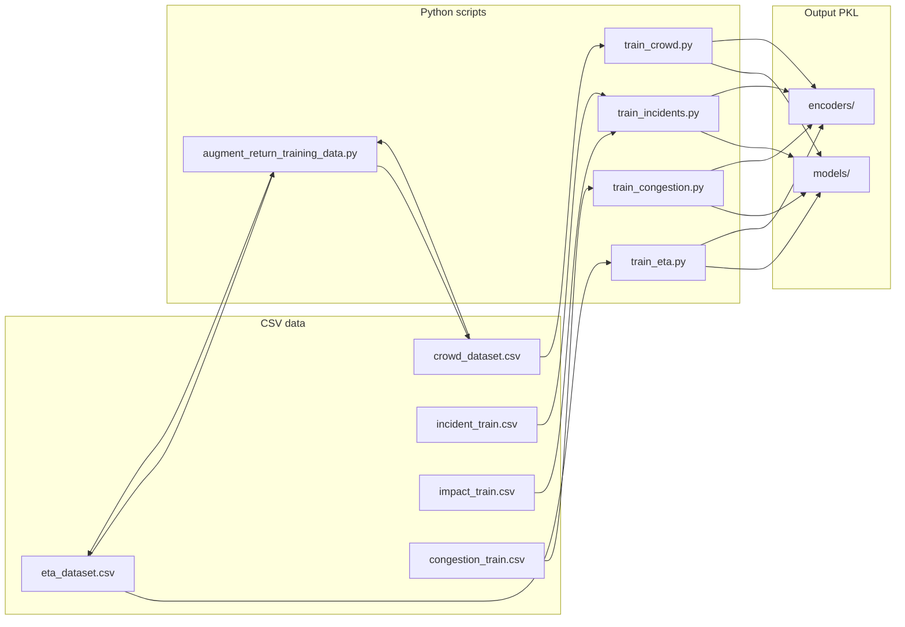
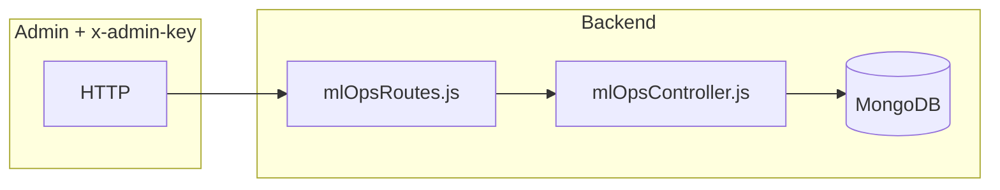

# ML training and configuration (simple guide)

**Two different things live here:**

1. **Offline training** — Python scripts read **CSV** files and write **PKL** files. FastAPI **loads PKL at startup** to answer requests.
2. **Registry in MongoDB** — Records **which model version is “active”** for bookkeeping, **feature flags**, and **audit logs**. It does **not** automatically replace `.pkl` files on disk (that would be a deploy pipeline or manual file copy).

---

## Workflow A — training (CSV → PKL)

## Workflow B — registry (optional ops UI)

---

## Master list — all training CSV files

| File | Used by |
|------|---------|
| [`ai-services/data/eta_dataset.csv`](../ai-services/data/eta_dataset.csv) | `train_eta.py` |
| [`ai-services/data/crowd_dataset.csv`](../ai-services/data/crowd_dataset.csv) | `train_crowd.py` |
| [`ai-services/data/incident_train.csv`](../ai-services/data/incident_train.csv) | `train_incidents.py` (classification) |
| [`ai-services/data/impact_train.csv`](../ai-services/data/impact_train.csv) | `train_incidents.py` (impact) |
| [`ai-services/data/congestion_train.csv`](../ai-services/data/congestion_train.csv) | `train_congestion.py` (often regenerated by script) |

---

## Master list — all PKL files (paths from `ml_paths.py`)

### `ai-services/models/`

| File | Created by | Loaded in |
|------|------------|-----------|
| `eta_model.pkl` | `train_eta.py` | `app/main.py` |
| `crowd_model.pkl` | `train_crowd.py` | `app/main.py` |
| `incident_category_clf.pkl` | `train_incidents.py` | `app/api/incidents.py` |
| `incident_severity_clf.pkl` | `train_incidents.py` | `app/api/incidents.py` |
| `impact_delay_model.pkl` | `train_incidents.py` | `app/api/incidents.py` |
| `impact_recovery_model.pkl` | `train_incidents.py` | `app/api/incidents.py` |
| `congestion_model.pkl` | `train_congestion.py` | `app/api/congestion.py` |

### `ai-services/encoders/`

| File | Created by | Used for |
|------|------------|----------|
| `route_encoder.pkl` | `train_eta.py` | ETA |
| `stop_encoder.pkl` | `train_eta.py` | ETA + crowding |
| `traffic_encoder.pkl` | `train_eta.py` | ETA |
| `crowd_encoder.pkl` | `train_crowd.py` | Crowding output labels |
| `incident_vectorizer.pkl` | `train_incidents.py` | Incident text |
| `impact_category_encoder.pkl` | `train_incidents.py` | Impact features |
| `impact_severity_encoder.pkl` | `train_incidents.py` | Impact features |
| `congestion_segment_encoder.pkl` | `train_congestion.py` | Congestion segments |

---

## Python files for training and paths

| File | Role |
|------|------|
| [`ai-services/ml_paths.py`](../ai-services/ml_paths.py) | Defines every path above |
| [`ai-services/training/paths.py`](../ai-services/training/paths.py) | Re-exports for scripts |
| [`ai-services/training/train_eta.py`](../ai-services/training/train_eta.py) | ETA |
| [`ai-services/training/train_crowd.py`](../ai-services/training/train_crowd.py) | Crowding |
| [`ai-services/training/augment_return_training_data.py`](../ai-services/training/augment_return_training_data.py) | Rebuilds ETA + crowd rows for `... (Return)` routes from `routes.json` before retraining |
| [`ai-services/training/train_incidents.py`](../ai-services/training/train_incidents.py) | Incidents + impact |
| [`ai-services/training/train_congestion.py`](../ai-services/training/train_congestion.py) | Congestion |
| [`ai-services/scripts/generate_ml_datasets.py`](../ai-services/scripts/generate_ml_datasets.py) | Optional helper to generate datasets |

---

## Registry + flags + audit (Mongo — no PKL)

| File | Role |
|------|------|
| [`backend/models/ModelRegistry.js`](../backend/models/ModelRegistry.js) | Stores modelKey, version, status, metrics |
| [`backend/models/FeatureFlag.js`](../backend/models/FeatureFlag.js) | Key/value flags |
| [`backend/models/AuditLog.js`](../backend/models/AuditLog.js) | Who did what |
| [`backend/controllers/mlOpsController.js`](../backend/controllers/mlOpsController.js) | API logic |
| [`backend/routes/mlOpsRoutes.js`](../backend/routes/mlOpsRoutes.js) | `/api/ml/*` |
| [`backend/middleware/requireAdminKey.js`](../backend/middleware/requireAdminKey.js) | Protects routes |

**Verify registry:** `GET /api/ml/models` with `x-admin-key`.

---

## `.gitignore` note

Root [`.gitignore`](../.gitignore) ignores generic `*.pkl` but **allows** `ai-services/models/*.pkl` and `ai-services/encoders/*.pkl` so committed repos can include trained files. Your local `.env` is always ignored.
