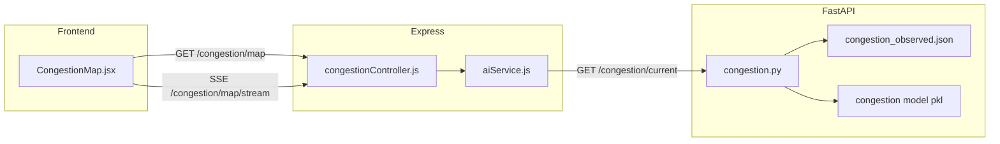

# Real-time congestion monitoring & prediction — workflow

## 1. Authority map view (`CongestionMap.jsx`)

1. User selects **hour** (and the client may pass **dow** in the future).
2. **`GET /api/congestion/map`**:
   - **`congestionController.getMap`** → **`buildMapFeatures`**
   - Calls **`getCongestionCurrent`** (`aiService.js`) → FastAPI **`GET /congestion/current`** with optional `hour`, `dow`.
   - Python (`congestion.py`) loads segment keys from the trained encoder (or builds them from `routes.json`), runs the classifier per segment, merges **observed** levels from `congestion_observed.json` when present.
   - Node pairs each segment with **from/to stop coordinates** from `stops.json` and returns **features** (polylines, levels, `model_level`, `source`).

3. **`EventSource`** connects to **`GET /api/congestion/map/stream`**:
   - **SSE** `congestion_update` events when the signature of segment levels changes (polling loop server-side), giving near–real-time refresh without manual reload.

## 2. Raw AI endpoints (dashboards, tools)

- **`GET /api/congestion/current`** — same underlying AI response as map (no geometry enrichment).
- **`GET /api/congestion/forecast`** — hourly **timeline** with city-wide HIGH/MEDIUM/LOW counts per step.
- **`POST /api/congestion/predict`** — batch segment prediction for arbitrary keys (also used internally by the commute planner).

## 3. Model activation path

1. On FastAPI startup, **`main.py`** reads **`ai-services/data/active_model_manifest.json`**.
2. If an entry exists for **congestion** with **`artifactPath`**, **`configure_runtime_artifacts`** loads that model/encoder instead of defaults under `ml_paths`.
3. Ops staff typically register/activate models via **`/api/ml`** (see ML ops docs); **`activateModel`** in `mlOpsController.js` writes the manifest file.

## 4. Data fusion rule (current snapshot)

For each segment, Python prefers **observed** level from `congestion_observed.json` when available; otherwise uses **model** prediction — see `source` field in API output.

## End-to-end diagram

