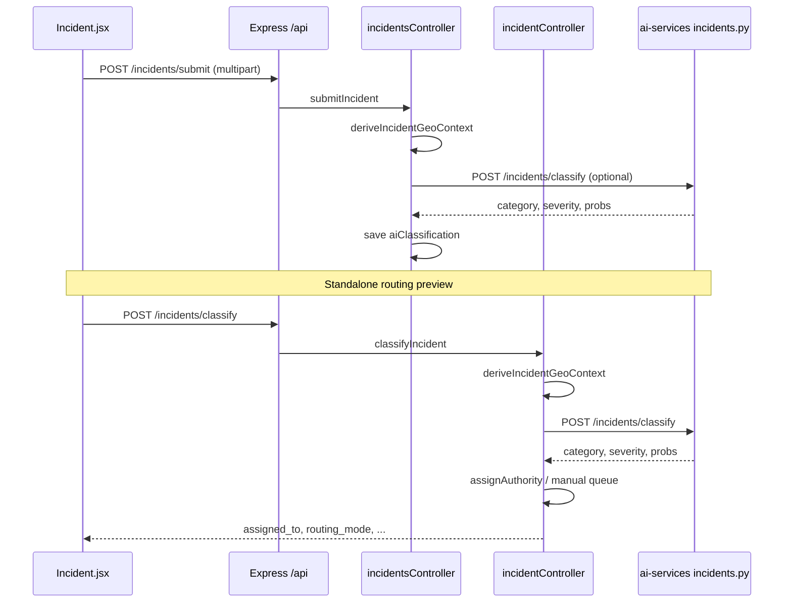

# Incident classification & routing — workflow

## A. Incident submitted through the main app (`POST /api/incidents/submit`)

1. **Route:** `backend/routes/index.js` applies `requireAuth`, `requireActiveAccount`, `requireRoles`, and `upload.array` for media.
2. **Controller:** `submitIncident` in `incidentsController.js` runs:
   - Loads stops via `loadStopsDataset` / `buildIncidentAreasFromStops` from `incidentImpactService.js`.
   - Resolves coordinates (map pick or area centroid), validates area.
   - **`deriveIncidentGeoContext`** (same service) for nearest stop, zone, route segment context.
   - Persists a Mongoose **`Incident`** document.
   - **After save:** tries **`classifyIncident`** from `aiService.js` → FastAPI **`POST /incidents/classify`** with `text` + `location` string; on success, merges into **`aiClassification`** and saves again; on AI failure, submission still succeeds.

This path stores ML output but does **not** automatically assign `assignedTo` on the document from `assignAuthority` (that logic lives on the dedicated classify endpoint below).

## B. Standalone classification + explicit routing (`POST /api/incidents/classify`)

Used when clients need **`assigned_to`** and review metadata in one response.

1. **Route:** `backend/routes/incidentRoutes.js` → `classifyIncident` in **`incidentController.js`** (not `incidentsController.js`).
2. **Validation:** Description length/quality; geo required → **`deriveIncidentGeoContext`** from body (`latitude`/`longitude` and/or `location` text).
3. **Network guard:** If `network_status === 'out_of_network'`, returns 422 with guidance.
4. **AI call:** **`classifyIncidentWithAi`** (`aiService.js`) → **`POST /incidents/classify`**.
5. **Python:** `ai-services/app/api/incidents.py` runs vectorizer + two classifiers if artifacts exist; otherwise **`_fallback_classify`** keyword rules.
6. **Trust evaluation:** `evaluateClassificationTrust` compares probabilities to env thresholds; sets **`routing_mode`** to `manual_review` or `auto`.
7. **Routing assignment:**
   - If manual review → **`Manual classification review queue`**.
   - Else → **`assignAuthority(category, severity, affectedPreview, geo)`** returns a human-readable desk name (e.g. operator fleet desk, traffic control, escalation), using **zone** (`busy`), **network_status**, **category**, **severity**, and first affected route.

Response includes `assigned_to`, `routing_mode`, confidence fields, geo context, and **`affected_routes`** preview from `deriveIncidentGeoContext`.

## C. Express routing note

Both **`backend/routes/index.js`** (mounted at `/api`) and **`backend/app.js`** mount paths under **`/api/incidents`**. The effective handler depends on registration order in `app.js`: module routes from `index.js` are mounted first at `/api`, then `incidentRoutes` at `/api/incidents`. Endpoints like **`/api/incidents/submit`** are defined only on `index.js`; **`/api/incidents/classify`** is only on `incidentRoutes`. Clients must use the correct path for each operation.

## D. Data flow summary

