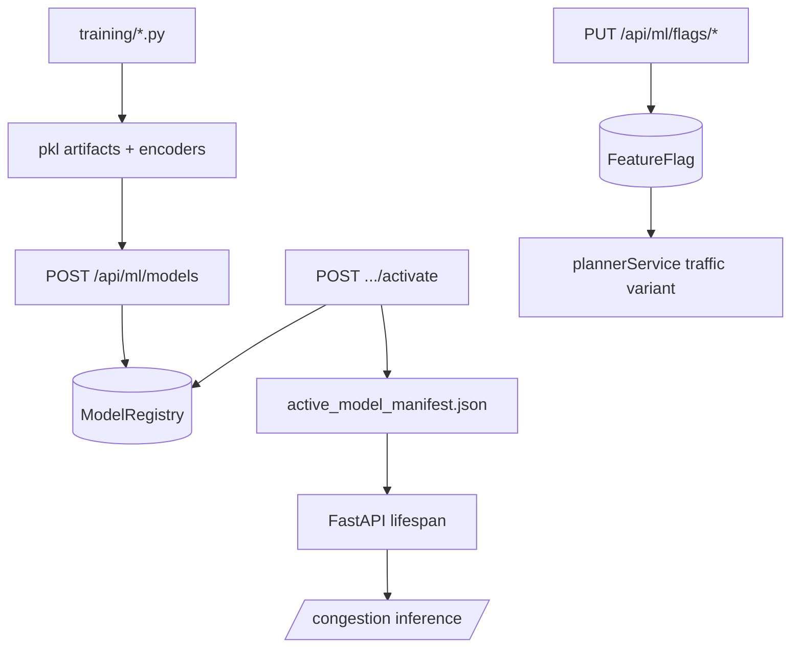

# AI model training & configuration management — workflow

## 1. Offline training (developer / CI)

1. Prepare or generate datasets under **`ai-services/data/`** (CSV paths defined in **`ml_paths.py`**).
2. Run training scripts from repo docs / README, e.g.:
   - **`python ai-services/training/train_eta.py`**
   - **`python ai-services/training/train_crowd.py`**
   - **`python ai-services/training/train_congestion.py`**
   - **`python ai-services/training/train_incidents.py`**
3. Scripts write **`models/*.pkl`** and **`encoders/*.pkl`** as configured in **`ml_paths.py`**.
4. FastAPI **`main.py`** startup **requires** ETA + crowding artifacts; incident and congestion modules degrade or configure per their loaders.

## 2. Register and activate a model version (API)

Authorized **`SYSTEM_ADMIN`** or **`ML_DEVOPS_ENGINEER`** calls:

1. **`POST /api/ml/models`** — **`registerModel`**: creates **`ModelRegistry`** row (draft metadata, **`artifactPath`**, metrics, optional nested **`featureFlags`** on the document).
2. **`POST /api/ml/models/:id/activate`** — **`activateModel`**:
   - Archives other **active** rows for the same **`modelKey`**.
   - Sets chosen doc to **`active`**.
   - **`writeActiveModelManifest`** merges into **`ai-services/data/active_model_manifest.json`** (used by Python for congestion path override).
   - Writes **`AuditLog`** (`ml_model.activate`).

3. **`POST /api/ml/models/:id/rollback`** — finds latest other version for that **`modelKey`**, activates it, updates manifest, audits.

4. **`PUT /api/ml/models/:id/rollout`** — adjusts **`rolloutPercentage`** (stored on registry; wire-up to canary routing would be downstream).

## 3. Runtime pickup (FastAPI)

1. Service restarts (or process manager reload).
2. **`main.py`** reads **`active_model_manifest.json`** and passes congestion **`artifactPath`** into **`configure_runtime_artifacts`**.
3. **`congestion.py`** reloads the congestion classifier/encoder from the resolved paths.

**Note:** Changing ETA, crowding, or incident `.pkl` files on disk still depends on process restart to reload `joblib` objects in **`main.py`** / **`incidents.py`** unless a reload mechanism is added.

## 4. Feature flags (experiments)

1. **`PUT /api/ml/flags/:key`** — **`upsertFlag`** persists to **`FeatureFlag`** collection and audits.
2. Example: key **`traffic_prediction_mode`** is read in **`plannerService.resolveTrafficLevelForPlanning`** and forwarded to **`POST /congestion/planner-traffic`** as **`model_variant`** for experimentation.

## 5. Audit & UI

1. **`GET /api/ml/audit`** — recent **`AuditLog`** entries for governance.
2. **`AdminConsole.jsx`** fetches **`GET /api/ml/models`** and **`GET /api/ml/runtime-manifest`** so operators see registry rows vs active manifest.

## Flow diagram

