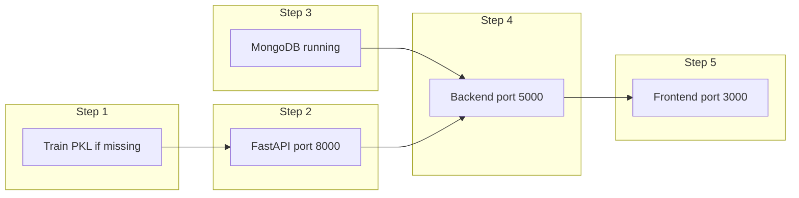

# Run everything (simple runbook)

This tells you **what to install**, **what `.pkl` files are**, **how env vars work**, and **in what order** to start AI → backend → frontend so you can test the app.

---

## 1. Environment files (no secrets in git)

The repo **does not commit** `.env` files (they are in `.gitignore`). You keep **`backend/.env`** and **`frontend/.env`** on your machine only.

**Backend** loads `backend/.env` via `import 'dotenv/config'` in `server.js`.

| Variable | What it is |
|----------|------------|
| `MONGO_URI` | **Your** MongoDB connection string (local or Atlas). The app needs this to start. |
| `AI_SERVICE_URL` | Base URL of FastAPI, e.g. `http://localhost:8000` (no trailing slash). |
| `PORT` | Backend port (default `5000`). |
| `ADMIN_KEY` | Optional. If unset, admin routes accept `x-admin-key: dev-secret-admin`. |
| `FLEET_SIM_TIME_SCALE` | Optional planner simulation speed multiplier (default `1`). Example: `20` means simulation clock runs 20x faster. |
| `SOCKET_CORS_ORIGIN` | Optional Socket.IO CORS origin (default `*`) for live bus websocket testing. |

**Frontend** only sees variables named `VITE_*`.

| Variable | What it is |
|----------|------------|
| `VITE_API_URL` | API base URL, e.g. `http://localhost:5000/api` |
| `VITE_SOCKET_URL` | Optional explicit websocket URL, e.g. `http://localhost:5000` (recommended for teammate clarity) |

---

## 2. What are the `.pkl` files?

They are **saved machine-learning artifacts** created by Python (`joblib.dump`). The FastAPI app **loads** them at startup and uses them to predict numbers or labels.

| Folder | What lives there |
|--------|------------------|
| `ai-services/models/*.pkl` | Trained models (RandomForest, LogisticRegression, etc.) |
| `ai-services/encoders/*.pkl` | Label encoders and the incident TF-IDF vectorizer |

**You do not edit `.pkl` files by hand.** You regenerate them by running the training scripts (see below).

**Git:** `.gitignore` allows `ai-services/models/*.pkl` and `ai-services/encoders/*.pkl` so the team can commit working models. If a file is missing, run the matching training script.

---

## 3. Train models (creates CSV + PKL)

From folder `ai-services/`:

```bash
pip install -r requirements.txt
python training/augment_return_training_data.py
python training/train_eta.py
python training/train_crowd.py
python training/train_incidents.py
python training/train_congestion.py
```

`augment_return_training_data.py` keeps planner ETA/crowd CSVs aligned with bidirectional routes (`... (Return)` rows) and is safe to re-run.

After this you should see `.pkl` files under `models/` and `encoders/`, and CSVs under `data/` (some scripts write or overwrite training CSVs).

---

## 4. Start order



1. **MongoDB** running and `MONGO_URI` correct in `backend/.env`.
2. **FastAPI** (from folder `ai-services/`):

   Use **`python -m uvicorn`** so you do not rely on the `uvicorn` executable being on your PATH (common on Windows after `pip install --user`):

   ```bash
   python -m uvicorn app.main:app --reload --host 0.0.0.0 --port 8000
   ```

   **PowerShell** (if imports fail, set the project root on `PYTHONPATH`):

   ```powershell
   $env:PYTHONPATH = "."
   python -m uvicorn app.main:app --reload --host 0.0.0.0 --port 8000
   ```

3. **Backend:** `cd backend` → `npm install` → ensure `backend/.env` has `MONGO_URI`, `AI_SERVICE_URL=http://localhost:8000`, etc. → `npm run dev`.
4. **Frontend:** `cd frontend` → `npm install` → ensure `frontend/.env` has `VITE_API_URL` if needed → `npm run dev`.

Checks:

- `http://localhost:8000/health` — AI up  
- `http://localhost:5000/health` — API up  
- `http://localhost:3000` — UI up  

---

## 5. Quick feature smoke tests

| Page | URL | Needs |
|------|-----|--------|
| Planner | `/planner` | Backend + AI + trained ETA/crowd |
| Incidents | `/incident` | Backend + AI + incident PKL |
| Congestion map | `/congestion` | Backend + AI + congestion PKL + `stops.json` coords |
| Dashboard | `/dashboard` | Backend + AI for forecast |

Planner simulation APIs (Phase 4):

- `GET /api/planner/sim/fleet` — multi-bus fleet snapshot, loop counts, shift windows, live positions
- `GET /api/planner/sim/buses/:bus_id` — one bus state
- `GET /api/planner/sim/history?limit=200` — recent completed loop history (JSONL-backed)

Planner tracking APIs (Phase 5):

- `POST /api/planner/sim/session` with `{ origin, destination, route_name, boarding_stop? }` — bind best matching active simulated bus
- `GET /api/planner/sim/session/:session_id` — live tracker status (`eta_to_user_min`, bus position, optional `eta_to_destination_min`)
- `POST /api/planner/sim/session/:session_id/onboard` — mark rider onboard; tracker switches to destination ETA

Live websocket skeleton (Nearby/Live module foundation):

- Socket.IO path on backend server (same port as API, e.g. `ws://localhost:5000`)
- Events:
  - server -> client: `live:connected`, `live:buses`, `live:error`
  - client -> server: `live:subscribe` (request immediate snapshot)

---

## 6. If something fails

| Problem | Check |
|---------|--------|
| `uvicorn` is not recognized (Windows) | Use `python -m uvicorn ...` from `ai-services/` instead of bare `uvicorn` |
| Backend exits immediately | `MONGO_URI` wrong or Mongo down |
| 503 / “AI_SERVICE_URL” | Backend `.env` missing `AI_SERVICE_URL` or FastAPI not running |
| ETA 400 “Unknown route” | Stop/route spelling must match `routes.json` and training data |
| Routes changed but planner still misses reverse direction | Re-run `python training/augment_return_training_data.py` then retrain ETA/crowd/congestion and restart AI + backend |
| Empty map | Stop names on segments must exist in `ai-services/data/stops.json` with lat/lon |
| Admin 401 | Send header `x-admin-key` matching `ADMIN_KEY` or use `dev-secret-admin` |

---

## 7. Full file list (AI side)

See [`feature-ml-training-and-configuration.md`](./feature-ml-training-and-configuration.md) for every `.py`, `.csv`, and `.pkl` path in one place.
